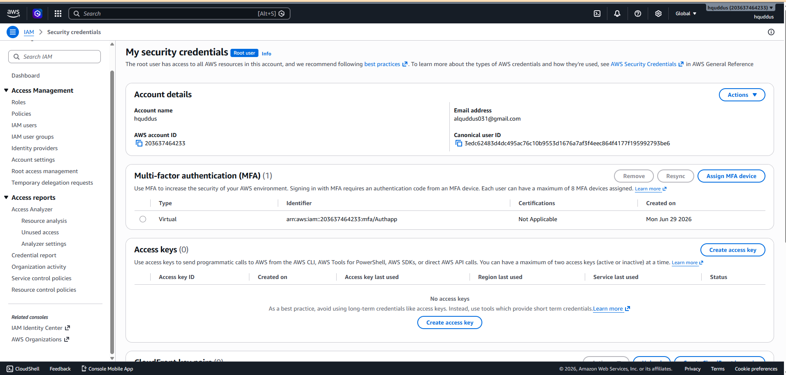
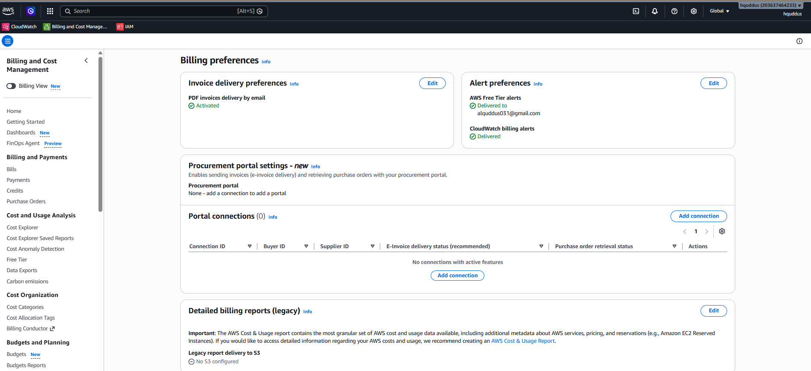
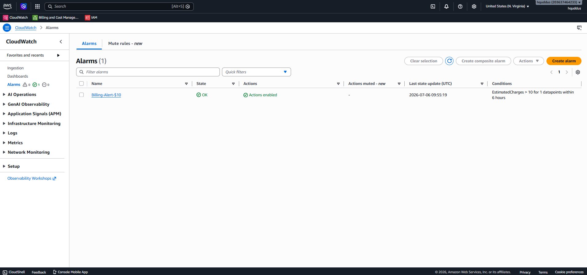
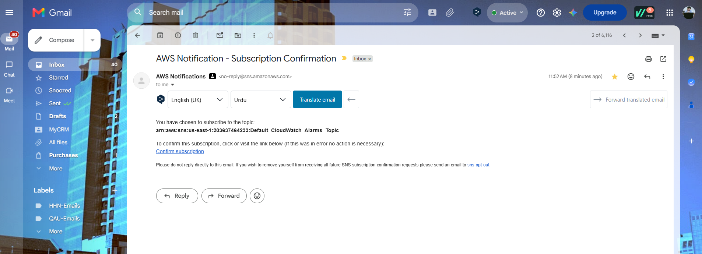
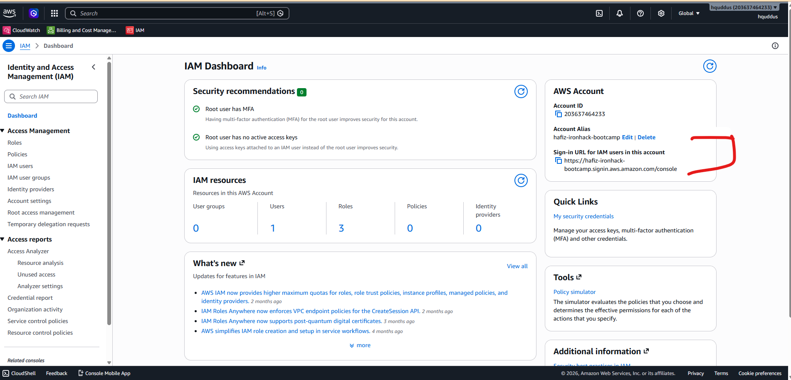
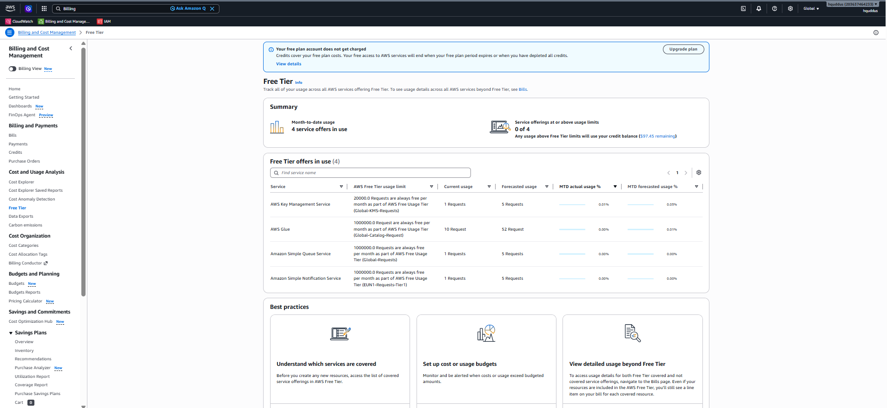

# AWS Account Setup Lab - Solution

**Student Name:** [Your Name]
**Date Completed:** [Date]

---

## Exercise 1: MFA Configuration

### Screenshot:

### Notes:

- Authenticator app used: [Google Authenticator]
- MFA setup completed successfully: [Yes]
- Backup codes saved: [No]

---

## Exercise 2: Billing Alerts

### Screenshots:

**Billing Preferences:**

**Billing Alarm:**

**SNS Confirmation:**

### Configuration Details:

- Alert threshold: $[10]
- Email confirmed: [Yes]
- Additional thresholds created (bonus): [No]

---

## Exercise 3: Account Alias

### Screenshot:

### Account Details:

- **Account Alias:** [hafiz-ironhack-bootcamp]
- **Sign-In URL:** `https://hafiz-ironhack-bootcamp.signin.aws.amazon.com/console`
- **Tested successfully:** [Yes]

---

## Exercise 4: Free Tier Dashboard

### Screenshot:

### Current Free Tier Usage Summary:

| Service | Current Usage         | Free Tier Limit | Status             |
| ------- | --------------------- | --------------- | ------------------ |
| EC2     | [X hours / 750 hours] | 750 hours/month | [Green/Yellow/Red] |
| S3      | [X GB / 5 GB]         | 5 GB            | [Green/Yellow/Red] |
|         |                       |                 |                    |

|  |  |  |  |  |  |
| - | - | - | - | - | - |

| Service                            | AWS Free Tier usage limit                                                                           | Current usage | Forecasted usage | MTD actual usage % | MTD forecasted usage % |
| ---------------------------------- | --------------------------------------------------------------------------------------------------- | ------------- | ---------------- | ------------------ | ---------------------- |
| AWS Key Management Service         | 20000.0 Requests are always free per month as part of AWS Free Usage Tier (Global-KMS-Requests)     | 1 Requests    | 5 Requests       | 0.01%              | 0.03%                  |
| AWS Glue                           | 1000000.0 Request are always free per month as part of AWS Free Usage Tier (Global-Catalog-Request) | 10 Request    | 52 Request       | 0.00%              | 0.01%                  |
| Amazon Simple Queue Service        | 1000000.0 Requests are always free per month as part of AWS Free Usage Tier (Global-Requests)       | 1 Requests    | 5 Requests       | 0.00%              | 0.00%                  |
| Amazon Simple Notification Service | 1000000.0 Requests are always free per month as part of AWS Free Usage Tier (EUN1-Requests-Tier1)   | 1 Requests    | 5 Requests       | 0.00%              | 0.00%                  |

### Notes:

- Any services approaching limits? [Yes]
- Any unexpected usage? [Yes]

---

## Exercise 5: Reflection Questions

### 1. Why is MFA important even for a personal learning account?

**Your Answer:**
Multi-Factor Authentication (MFA) is important even for a personal learning account because unauthorized access can lead to security breaches, hacking attempts, and phishing attacks. If an attacker gains access to the account, they may misuse cloud resources, access private information, or create unexpected financial charges. MFA adds an extra layer of security and helps protect personal data, account privacy, and AWS resources.

---

### 2. What would happen if you left your root user unprotected?

**Your Answer:**
If the root user is left unprotected, an attacker who gains access can have complete control over the AWS account, including access to services, billing information, security settings, and stored data. They could steal sensitive information, misuse resources, change configurations, or create financial losses by consuming paid services. Recovery may require regaining access through the root email account and updating security settings. To prevent such risks, the root user should always be protected with strong security practices, especially enabling Multi-Factor Authentication (MFA).

---

### 3. How do billing alerts help prevent unexpected charges?

**Your Answer:**
Billing alerts help prevent unexpected charges by continuously monitoring the usage and cost of AWS resources. By setting billing thresholds, users receive notifications when their spending reaches a specific limit. These alerts allow users to review their resource usage, stop unnecessary services, and take action before costs increase. Proactive monitoring is important because it provides better control over cloud spending and helps avoid unexpected bills.

---

### 4. What threshold did you set for your billing alert and why?

**Your Answer:**
Since I am currently using AWS Free Tier services for learning purposes, I set my billing alert threshold at $10. This allows me to understand how billing alarms work while keeping my usage within a safe limit. The $10 threshold is suitable because my Free Tier credits and usage are limited. In the future, I would set multiple thresholds to monitor different spending levels, prioritize actions, and maintain better control over AWS service costs.

---

### 5. What is your account alias and why did you choose it?

**Your Answer:**

- **Alias:** hafiz-ironhack-bootcamp
- **Reasoning:** I chose this alias because "Hafiz" is my nickname, which makes the account easy for me to recognize and remember. I also included "Ironhack Bootcamp" to clearly identify the purpose of this AWS account and connect it with my learning journey. This naming approach makes the alias simple, organized, and professional for managing my AWS activities during the bootcamp

---

### 6. What services are you currently using according to the Free Tier dashboard?

**Your Answer:**
According to my AWS Free Tier dashboard, I am currently using the following services:

i. AWS Key Management Service (AWS KMS)
ii. AWS Glue
iii. Amazon Simple Queue Service (Amazon SQS)
iv. Amazon Simple Notification Service (Amazon SNS)

Most of these services were expected as part of learning and exploring different AWS features. However, I was surprised to see AWS Glue usage because I was not expecting this service to appear in my current usage. This helped me understand the importance of regularly checking the Free Tier dashboard to monitor active services, track resource consumption, and prevent unexpected charges.

---

## Bonus Challenges Completed (Optional)

### Challenge 1: Multiple Billing Alert Thresholds

- [ ] $5 threshold
- [ ] $25 threshold
- [ ] $50 threshold

**Screenshots (if completed):**
[Add screenshots here]

---

### Challenge 2: CloudTrail Enabled

- [ ] CloudTrail enabled
- [ ] Logging to S3 configured

**Notes:**
[Add any notes about CloudTrail setup]

---

### Challenge 3: AWS Trusted Advisor Reviewed

- [ ] Accessed Trusted Advisor
- [ ] Reviewed recommendations

**Key recommendations found:**
[List any recommendations you found]

---

## Lessons Learned

**What was the most challenging part of this lab?**

Setting billing alarm was a bit challenging.

---

**What would you do differently next time?**

Setting the region preferences first before setting billing preferences. 

---

**What security practices will you implement going forward?**

At the moment, google authentication application, in the future I may use my cell phone number as authentication. 

---

## Checklist Before Submission

- [X] All required screenshots captured and saved
- [X] Screenshots are clear and show relevant information
- [X] All reflection questions answered thoroughly
- [X] Account alias documented
- [X] Free Tier usage documented
- [X] Work committed to Git
- [X] Pull request created
- [X] PR URL submitted to Student Portal

---

**Lab Completed By:** [Hafiz Abdul Quddus]
**Date:** [06-07-2026]
